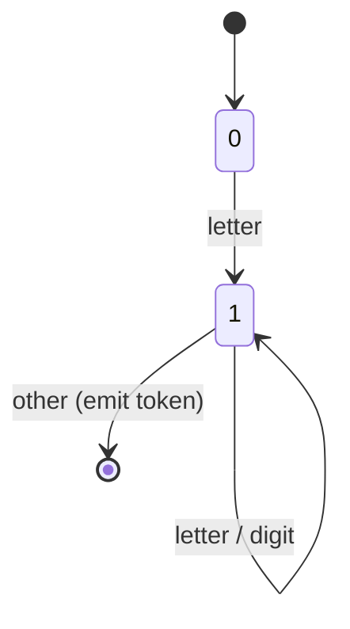
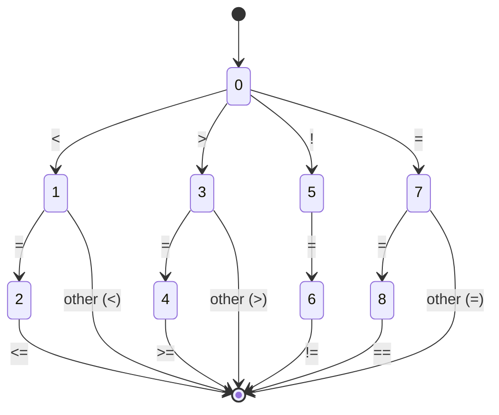

## 1. Introduction to Compilers and Source Program Analysis

### 1.1 What Is a Compiler?
A compiler is a program that reads a source program written in a high-level language (the **source language**) and translates it into an equivalent program in another language (the **target language**), typically machine code or assembly. Crucially, it also reports errors in the source program. The translation is not merely a one-to-one mapping; it involves deep analysis and synthesis to preserve the meaning exactly.

The process can be split into two large halves:
- **Analysis (Front End):** Breaks the source into pieces, checks correctness, builds an intermediate representation.
- **Synthesis (Back End):** Constructs the desired target program from the intermediate representation.

---

## 2. The Phases of a Compiler – Detailed Walkthrough

A compiler operates as a sequence of **phases**, each transforming the program from one representation to another. The symbolic table management and error handling interact with all phases.

### 2.1 List of Phases (Normal Order)
1. Lexical Analysis (Scanner)
2. Syntax Analysis (Parser)
3. Semantic Analysis
4. Intermediate Code Generation
5. Code Optimization
6. Code Generation

Often, the first three to four phases constitute the **front end**, while the last two form the **back end**. (Some authors place intermediate code generation in the front end.)

### 2.2 Detailed Phase Actions with Example Strings 

We illustrate using two of the PYQ expressions: `A = B * C + D/E` and `position := initial + rate * 60`.

---

#### Phase 1: Lexical Analysis (Scanning)
**Action:** Reads the source character stream, groups characters into **lexemes** and produces **tokens** with attributes. Strips whitespace and comments.

- For `A = B * C + D/E`:
  Lexemes: `A`, `=`, `B`, `*`, `C`, `+`, `D`, `/`, `E`
  Tokens: <id, pointer to “A”>, <=>, <id, “B”>, <*, >, <id, “C”>, <+>, <id, “D”>, </>, <id, “E”>
- For `position := initial + rate * 60`:
  Lexemes: `position`, `:=`, `initial`, `+`, `rate`, `*`, `60`
  Tokens: <id, “position”>, <assign_op, “:=”>, <id, “initial”>, <+>, <id, “rate”>, <*>, <num, 60>

**Output:** A stream of tokens that serves as input to the parser.

---

#### Phase 2: Syntax Analysis (Parsing)
**Action:** Groups tokens into grammatical phrases represented by a **parse tree**. Verifies that the token pattern matches the language grammar.

Using grammar rules like  
`stmt → id = expr`  
`expr → expr + term | term`  
`term → term * factor | factor`  
`factor → id | num | ( expr )`

- For `A = B * C + D/E`: The parser builds a tree with `=` at root, left child `A`, right child an expression. Subtree: `+` with left `B * C` and right `D / E`.
- For `position := initial + rate * 60`: The grammar distinguishes `:=` as assignment, yields a tree where `*` has higher precedence than `+`, so multiplication of `rate` and `60` is a subtree, added to `initial`.

**Output:** A parse tree or abstract syntax tree (AST) passed to semantic analysis.

---

#### Phase 3: Semantic Analysis
**Action:** Checks semantic consistency (type checking, scope, etc.) using the symbol table and annotates the syntax tree with types and operations.

- For `A = B * C + D/E`: Validates that `A`, `B`, `C`, `D`, `E` are declared numeric; implicit conversions if mixed types exist.
- For `position := initial + rate * 60`: Checks `position` and `initial` are of compatible type (e.g., real), `rate` is numeric, `60` is integer – may insert int-to-float conversion.

**Output:** An attributed syntax tree, ready for intermediate code generation.

---

#### Phase 4: Intermediate Code Generation
**Action:** Produces an explicit intermediate representation (IR), typically three-address code (TAC), which is machine-independent.

- For `A = B * C + D/E`:
  ```
  t1 = B * C
  t2 = D / E
  t3 = t1 + t2
  A = t3
  ```
- For `position := initial + rate * 60`:
  ```
  t1 = rate * 60.0   (after type conversion)
  t2 = initial + t1
  position = t2
  ```

**Output:** Sequence of IR instructions. This is still front-end territory.

---

#### Phase 5: Code Optimization
**Action:** Improves the IR to make it consume less time and space while preserving semantics. Includes local, global, and loop optimizations.

On `A = B * C + D/E` (assume D/E is invariant), little local optimization possible. For `X = Y + Z * 8.0`, constant folding may replace `Z * 8.0` at runtime? No, not constant. But if `8.0` is used elsewhere, strength reduction could turn `* 8.0` into a shift and addition if beneficial. More typical: the expression `Area = 3.14 * radius * radius` – common subexpression elimination might compute `radius * radius` once, and then multiply by 3.14.

**Output:** Optimized IR.

---

#### Phase 6: Code Generation
**Action:** Produces relocatable machine code or assembly code using target architecture specifics (register allocation, instruction selection).

Using a hypothetical assembly:
- `A = B * C + D/E`:
  ```
  LOAD  R1, B
  MUL   R1, C
  LOAD  R2, D
  DIV   R2, E
  ADD   R1, R2
  STORE A, R1
  ```
- `position := initial + rate * 60`:
  ```
  LOAD  R1, rate
  LOAD  R2, #60     (or float)
  MUL   R1, R2
  LOAD  R3, initial
  ADD   R1, R3
  STORE position, R1
  ```

**Output:** Target code. After linking and loading, the executable is ready.

### 2.3 Front-End vs Back-End – Responsibilities and Modular Design

- **Front-End:** Machine-independent tasks. Includes Lexical, Syntax, Semantic analysis, and usually Intermediate Code Generation. It understands the source language and creates an IR that represents the program’s meaning. Example tasks: parsing a `while` loop, building its AST, checking boolean condition type.
- **Back-End:** Machine-dependent tasks. Includes Code Optimization and Code Generation. It maps IR to target machine instructions, allocating registers, selecting addressing modes, and applying peephole optimizations.

**Modular Swapping:**  
To design a modular compiler, define a well-specified **Intermediate Representation** (IR) as a bridge. If we want to support a new source language (e.g., add Python front-end), we write a front-end that emits the common IR. If we want a new target (e.g., ARM instead of x86), we write a new back-end that consumes the IR. This reduces effort: M languages × N architectures require only M front-ends + N back-ends instead of M×N full compilers. The symbol table and error handler interfaces must also be standardized.

### 2.4 Compilation Process for `a = b + c * 70` (Step-by-Step Illustration)

Let’s trace the full pipeline for this simple statement, assuming C-like syntax and integers.

1. **Lexical Analysis**  
   Input characters: `a`, ` `, `=`, ` `, `b`, ` `, `+`, ` `, `c`, ` `, `*`, ` `, `7`, `0`  
   Tokens: `<id, a>` `<assign>` `<id, b>` `<plus>` `<id, c>` `<mult>` `<num, 70>`

2. **Syntax Analysis**  
   Grammar rule: `assignment → id = expr`  
   `expr → expr + term | term`  
   `term → term * factor | factor`  
   `factor → id | num`  
   Parse tree: `=` has left leaf `a`, right subtree `+` with left leaf `b`, right subtree `*` with `c` and `70`. This enforces `*` before `+`.

3. **Semantic Analysis**  
   Checks `a`, `b`, `c` are declared and numeric. `70` is an integer. Possibly add type conversion if `a` is float. Attach type annotations: all are `int`.

4. **Intermediate Code Generation**  
   Three-address code:
   ```
   t1 = c * 70
   t2 = b + t1
   a = t2
   ```

5. **Code Optimization**  
   If `70` is constant, strength reduction may replace multiplication with shift/add. Suppose `c * 70` = `(c<<6) + (c<<3) - c` etc. However, `70` is not power of two; a simple `MUL` remains. No common subexpressions, so output unchanged.

6. **Code Generation** (Assembly-like)  
   ```
   LOAD R1, c
   LOAD R2, #70
   MUL  R1, R2
   LOAD R2, b
   ADD  R1, R2
   STORE a, R1
   ```

### 2.5 Factors that Decide Phases in a Compiler
- Language complexity (static typing vs dynamic).
- Target machine characteristics (RISC vs CISC).
- Desired quality of generated code.
- Compile-time vs run-time trade-offs.
- Modularity/portability goals.  
Some compilers combine phases (e.g., parse and semantic analysis interleaved in single-pass compilers). Multi-pass compilers separate phases for better optimization and error reporting.

---

## 3. Cousins of a Compiler and Compiler-Construction Tools

### 3.1 Cousins of a Compiler
- **Preprocessor:** Handles macro substitution, file inclusion, conditional compilation. Output is pure source code.
- **Assembler:** Translates assembly language to relocatable machine code.
- **Linker:** Combines multiple object files and resolves external references to create a single executable.
- **Loader:** Loads the executable into memory and prepares for execution (dynamic linking, relocation).
- **Interpreter:** Executes source code directly without producing a compiled target; emulates a virtual machine. Often combined with compilation (e.g., Java’s bytecode + JIT).

### 3.2 Bootstrapping
A compiler written in its own language must be cross-compiled. The classic scenario: we have a new language L on machine A, we want a compiler for L that runs on machine B. Bootstrapping involves using intermediate machines.

**Arrangement for three machines A, B, and C:**
- We have a compiler for L written in L that runs on A (source).
- Write a tiny “kernel” compiler for a subset of L (L0) in assembly on B, sufficient to compile the full compiler.
- Use kernel to compile the full L compiler (written in L0) on B, producing a cross-compiler that runs on B but generates code for A. Then compile the L compiler (source) with this cross-compiler, generating a binary that runs on A. Now swap: use the A binary to produce a native compiler for B by recompiling source, or use three machines when two are not enough. A typical three-machine bootstrap: Machine C is used to first run an existing compiler to create a cross-compiler from A to B, etc.

Simplified: Use machine A (where L compiler in high-level exists) to compile the compiler source for target B, producing an executable that runs on B (cross-compilation). Then run that on B to compile itself, yielding a self-hosting compiler.

### 3.3 Single-Pass vs Multi-Pass Compilers
- **Single-Pass:** The compiler scans the source code exactly once, emitting target code on the fly. Stages are interleaved; semantic analysis and code generation occur immediately after parsing a construct. Suitable for early Pascal, C. Constraints: forward references need special handling (e.g., declare before use). Error recovery is limited.
- **Multi-Pass:** The compiler makes several passes over the program representation. Each phase writes output to a file, which the next reads. Allows more sophisticated optimizations and better error handling. Almost all modern optimizing compilers are multi-pass.

### 3.4 Token, Lexeme, Pattern – Definitions
- **Token:** A named category of lexical unit (e.g., `if`, `id`, `number`). Tokens may have attributes.
- **Lexeme:** The actual character string matching a pattern (e.g., `3.14`, `sum`, `<=`).
- **Pattern:** A rule describing a set of lexemes. For `number`, pattern is a regular expression like `digit+ ( . digit+ )?`.

Example from PYQ: `void sumnum(int i, int j)` → Lexemes `void`, `sumnum`, `(`, `int`, `i`, `,`, `int`, `j`, `)`. Tokens: `void` (keyword), `sumnum` (identifier), `(` (left paren), `int` (keyword), `i` (id), `,` (comma), `int`, `j`, `)`.

### 3.5 Compiler-Construction Tools
Tools that automate parts of compiler writing:
- **Lex (Flex):** Lexical analyzer generator.
- **Yacc (Bison):** Parser generator.
- **Syntax-directed translation engines.**
- **Data-flow analysis frameworks.**
- **Code generator generators.**
- **Integrated Development Environments** with semantic checking.

---

## 4. Lexical Analysis – Deep Dive

### 4.1 Role of a Lexical Analyzer (Scanner)
- Reads the source program character by character, groups them into lexemes.
- Strips whitespace and comments.
- Returns tokens to the parser on demand (usually a procedure call `getNextToken()`).
- Maintains the symbol table entry for identifiers (or parser may do it).
- Detects lexical errors (e.g., illegal characters) and reports them with line numbers.
- Possible interface: a global variable `token` and function `lex()` that sets `token` and attribute values.

### 4.2 Specification of Tokens – Regular Expressions
Tokens are specified using regular expressions. Common operations:
- **Union:** `R|S` matches strings in either.
- **Concatenation:** `RS` matches string from R followed by string from S.
- **Kleene closure:** `R*` matches zero or more repetitions.
- **Positive closure:** `R+` is one or more.
- **Optional:** `R?` is zero or one.
- **Character classes:** `[a-z]` means `a|b|...|z`.
- **Escape sequences:** `\n`, `\t`.

Example: Unsigned number = `digit+ ( . digit+ )? ( E (+|-)? digit+ )?`  
Identifier = `letter ( letter | digit )*`  
Relational operator = `<` | `<=` | `=` | `!=` | `>=` | `>`

### 4.3 Input Buffering in Lexical Analysis

**The Need:** A lexical analyzer must look ahead one or more characters to decide when a lexeme ends. For example, in `<=` vs `<`, after seeing `<`, we must peek at the next character to decide if it is `<` or `=`. Buffering is needed because reading one character at a time from disk is inefficient. The buffer is a block of memory that holds a portion of the source file.

#### One-Buffer Scheme
Uses a single buffer of size N (e.g., 4096). Two pointers: `lexeme_begin` and `forward`. When `forward` reaches the end of the buffer, we reload the next block from disk, moving any semi-processed lexeme to the beginning if it crosses the boundary. This often involves complicated shifting of characters.

#### Two-Buffer Scheme (Classic)
Uses two buffers of size N each, arranged so that the system can read ahead with sentinel character. The scheme divides the input into two halves of size N. The pointers `begin` (start of lexeme) and `forward` scan across the buffer halves. When `forward` moves into the other half, the other half can be filled asynchronously, avoiding moving characters. 

**Algorithm with Sentinel:**
We extend buffer to N+1 slots; the last slot holds **eof** sentinel. This makes the look-ahead test simpler: when advancing `forward`, we check the next character. If it’s the sentinel (which can be eof), we know we are at the end of a buffer half and must reload. But if it’s not sentinel, we can simply continue without any special check. This reduces the number of tests per character from two (check if end of buffer AND load) to one (check sentinel). Performance gain: ~2x fewer checks.

#### Two-Buffer Detailed Operation
- Two arrays `buf1[N+1]`, `buf2[N+1]`. Initially, fill `buf1` with first N characters, set `buf1[N] = eof`. `forward = buf1[0]`, `begin = forward`.
- Normal scanning: `forward++`; if `*forward == eof`, we are at the end of first half. Determine if we need second half:
  - If not yet loaded `buf2`, read next N characters into `buf2`, set `buf2[N] = eof`. Then set `forward = buf2[0]`.
  - Continue scanning.
- When `forward` hits sentinel in `buf2`, we wrap around to `buf1` after loading the next chunk from input into `buf1` (overwriting old data) and resetting sentinel. The `begin` pointer may be in the other half; care must be taken not to overwrite unprocessed lexeme.
- The sentinel technique: Before scanning inside a buffer half, we place `eof` at the sentinel slot. So the loop `while (*forward != eof) forward++;` runs without boundary checks.

#### Would a Three-Buffer Technique Improve Performance?
Adding a third buffer would not yield significant further improvement. The two-buffer scheme already overlaps I/O with computation (double buffering). A third buffer would increase memory usage without reducing the fundamental bottleneck – the look-ahead per character. The sentinel trick already minimizes condition checks. The two-buffer setup provides one buffer to process while the other is being filled; three buffers would introduce more complex pointer management for no speed gain. Thus, three buffers are not used.

### 4.4 Algorithm for “Look Ahead Code with Sentinels”

```c
// Lexical analyzer main loop using sentinel two-buffer
// Globals: char buf1[N+1], buf2[N+1];
// int forward_half = 1; // 1 if forward points in buf1, 2 if in buf2
// char *forward, *lexeme_begin;
// function reload(int half) fills the other half and sets sentinel.

void init_scan() {
   read N chars into buf1; buf1[N] = EOF;
   read N chars into buf2; buf2[N] = EOF;
   forward = buf1;
   lexeme_begin = forward;
   forward_half = 1;
}

char nextChar() {
   char c = *forward;
   if (c == EOF) {
      // Determine which half is ending.
      if (forward_half == 1) {
         // we have consumed all of buf1; switch to buf2
         forward = buf2;
         forward_half = 2;
         // reload buf1 for later
         reload(1);   // fills buf1 with next chunk, sets buf1[N]=EOF
      } else {
         forward = buf1;
         forward_half = 1;
         reload(2);
      }
      c = *forward; // first char of new buffer
   }
   forward++;
   return c;
}
// In practice, the loop does not call nextChar; it accesses *forward++ directly
// with sentinel.
```

**Sentinel Performance:** The sentinel eliminates the test for buffer end until the sentinel is actually encountered, which occurs only once per buffer half (every N characters). Without sentinel, every character advance must check if `forward` has reached the end of buffer. This cuts the number of tests by a factor of N, greatly improving speed.

### 4.5 Pseudocode Simulation of Two-Buffer Scheme with Token Formation

Let’s design a scanner for a snippet. Assume buffer size 8 for illustration, but typical N=1024 or 4096. We will show how the scanner processes `int k = 6;` with two buffers.

```
Buffer 1: [i][n][t][ ][k][ ][=][ ]  sentinel EOF
Buffer 2: [6][;][\n][...][...]...
```

**Initialization:** Load first N chars into Buf1, fill Buf2 with next N. Set `forward = &Buf1[0]`, `lexeme_begin = forward`.

**Token formation algorithm (simplified):**
```
Token getNextToken() {
   lexeme_begin = forward;
   skip whitespace: while (*forward == ' ' || *forward == '\t') forward++;
   if (isDigit(*forward)) {
      // Recognize number
      while (isDigit(*forward)) forward++;
      // After loop, forward points to first non-digit
      install_num(lexeme_begin, forward - lexeme_begin);
      return NUMBER;
   }
   if (isLetter(*forward)) {
      while (isLetterOrDigit(*forward)) forward++;
      // check if identifier or keyword
      install_id(lexeme_begin, forward - lexeme_begin);
      return ID;
   }
   // operators and punctuation...
   switch (*forward) {
      case '=': forward++; return ASSIGN;
      ...
   }
}
```
As `forward` advances, when it hits sentinel, the system detects `*forward == EOF`, triggers switching as described. The lexeme may span across buffer boundaries; the `lexeme_begin` remains in one buffer, while `forward` moves to the next. The token’s string must be extracted carefully, possibly copying.

During number recognition `6`: `forward` starts at '6', moves to ';', which stops the loop. `lexeme_begin` points to '6', length = 1. Token installed.

### 4.6 Transition Diagrams for Token Recognition

A transition diagram (deterministic finite automaton) maps states and edges labeled with characters. Used to systematically build a scanner.

**i. Identifier**  
Start state 0.  
- letter → state 1 (accepting)  
- In state 1: letter/digit → state 1, otherwise fallback and emit token.



**ii. Relational Operator**  
Start 0.  
- '<' → state 1  
  - from state 1: '=' → state 2 (accept '<='), otherwise fallback emit '<'  
- '>' → state 3  
  - from state 3: '=' → state 4 ('>=')  
- '!' → state 5  
  - from 5: '=' → state 6 ('!=')  
- '=' → state 7  
  - from 7: '=' → state 8 ('=='), else fallback '='  



**iii. Unsigned Number**  
Start 0.  
- digit → 1 (accepting). In state 1, digit → 1.  
- '.' from state 1 → state 2 (accepting) where digit → 2 and so on.  
- 'E' from state 1 or 2 → state 3; then optional '+'/'-', then digit → 4 (accepting), digit → 4.

Diagram:

```
digits = digit+
(0) --digit--> (1) --digit--> (1)
(1) --'.'--> (2) --digit--> (2)
(2) --digit--> (2)
(1) --E--> (3) --(+|-)--> (4) --digit--> (4)
(2) --E--> (3) ...
(4) --digit--> (4)
States 1,2,4 are final.
```

### 4.7 Lexemes and Tokens in Program Segment

Given:
```c
void sumnum(int i, int j) {
    int k = 6;
    return i+j;
}
```

Breakdown:

| Lexeme     | Token Type      | Pattern                     |
|------------|-----------------|-----------------------------|
| `void`     | KEYWORD         | exactly `void`              |
| `sumnum`   | IDENTIFIER      | letter(letter|digit)*       |
| `(`        | LPAREN          | `(`                         |
| `int`      | KEYWORD         | `int`                       |
| `i`        | IDENTIFIER      | as above                    |
| `,`        | COMMA           | `,`                         |
| `int`      | KEYWORD         |                             |
| `j`        | IDENTIFIER      |                             |
| `)`        | RPAREN          | `)`                         |
| `{`        | LBRACE          | `{`                         |
| `int`      | KEYWORD         |                             |
| `k`        | IDENTIFIER      |                             |
| `=`        | ASSIGN          | `=`                         |
| `6`        | CONSTANT        | digit+                      |
| `;`        | SEMICOLON       | `;`                         |
| `return`   | KEYWORD         | `return`                    |
| `i`        | IDENTIFIER      |                             |
| `+`        | PLUS            | `+`                         |
| `j`        | IDENTIFIER      |                             |
| `;`        | SEMICOLON       |                             |
| `}`        | RBRACE          | `}`                         |

---

## 5. Lexical Tools: LEX (Flex) Compiler

### 5.1 Working of LEX
LEX is a tool that automatically generates a lexical analyzer from a specification. The specification file (`.l`) defines patterns for each token and corresponding actions (C code). LEX translates these specifications into a deterministic finite automaton, implemented as a C function `yylex()`. The generated scanner uses the two-buffer input scheme internally.

### 5.2 Format of LEX Input File
A LEX source consists of three sections separated by `%%`:

```
definitions
%%
rules
%%
user subroutines
```

1. **Definitions Section**: Contains C code in `%{ %}`, declarations of states, regular definitions (name = pattern), e.g.,  
   `digit [0-9]`  
   `id [a-zA-Z][a-zA-Z0-9]*`

2. **Rules Section**: Each rule is a pattern followed by C code (action). Example:
   ```
   {digit}+                        { printf("NUMBER %s\n", yytext); return NUM; }
   {id}                            { printf("ID %s\n", yytext); return ID; }
   "if"                            { return IF; }
   [ \t\n]                         { /* skip whitespace */ }
   ```
   Patterns are regular expressions. LEX matches longest possible input string; if multiple patterns match same length, the first listed wins.

3. **User Subroutines**: Contains supporting C functions, e.g., `main()` calling `yylex()`, error handlers, symbol table routines. Can be in a separate file linked later.

LEX generates a C file that defines `yylex()` which, each time called, reads input and returns the token code. The `yytext` pointer holds the matched lexeme, `yyleng` its length.

**Integration with Yacc**: Yacc calls `yylex()` to get tokens. The generated parser uses `yylval` for attribute passing.

LEX’s scanning engine uses the sentinel-based two-buffer technique for high-speed lexical analysis.

---

## 6. Additional PYQ Integration: Bootstrapping, Grouping, Examples

### 6.1 Bootstrapping Arrangement for Three Machines A, B, and C
We have a cross-compiler for language L that runs on machine A and generates code for machine B. We want a compiler that runs on B (native). Using an intermediate machine C:
1. Write a simple interpreter for a subset of L in B’s assembly (or use existing).
2. Write the full L compiler source code in L-subset (bootstrap language).
3. Use the interpreter (on B) to run the compiler source, building a version that runs on B and outputs code for A (machine B native compiler). But we need code for B. So we then cross-compile: Take the L compiler source (full L) and compile on machine A with an existing A-based compiler to produce a cross-compiler that runs on A but generates code for C. Then use that to compile the compiler source again, producing a A→B cross-compiler; then run on B to get native. The three-machine method uses machine C as the “host” for intermediate steps.

### 6.2 Grouping of Phases – Pass Structure
- **Single-pass compilers** group lexical, syntax, semantic analysis and code generation into one pass; no explicit intermediate code stored.
- **Multi-pass compilers** typically separate into a **front end** (analysis until IR), a **middle end** (machine-independent optimizations), and a **back end** (machine-dependent code generation). This grouping eases retargeting and optimization.

### 6.3 “Cousins” Revisited
- **Preprocessor** is a cousin that can be separate (e.g., C preprocessor `cpp`) or integrated.
- **Assembler** often called by compiler driver.
- **Linker/Loader** finalize the executable.
- **Interpreter** avoids compilation altogether but may share parsing (e.g., BASIC).

